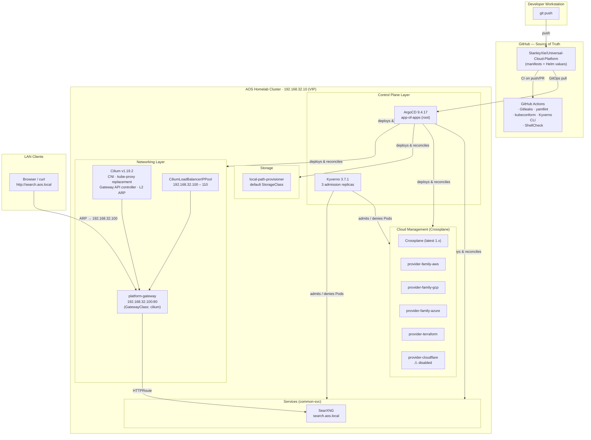
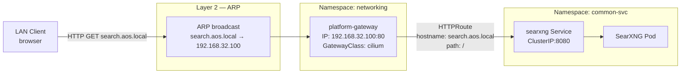
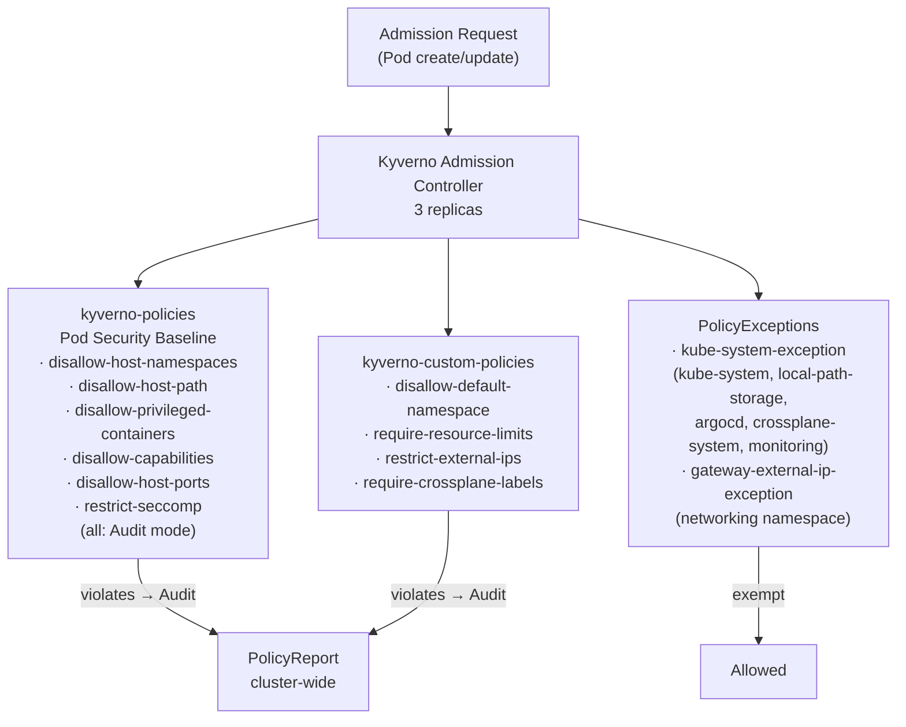
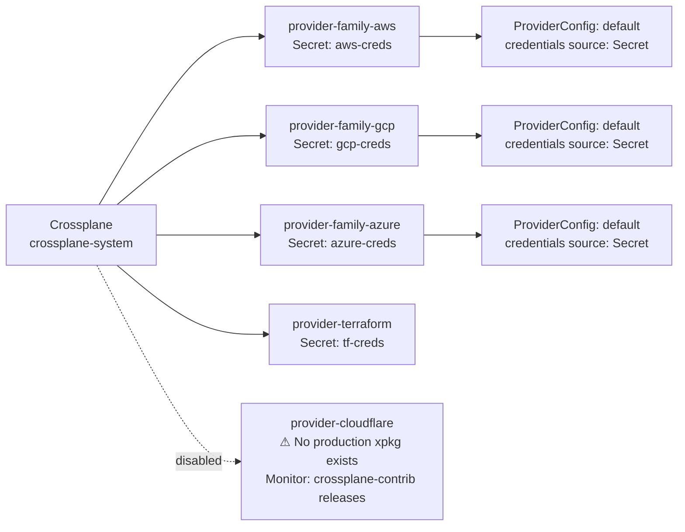
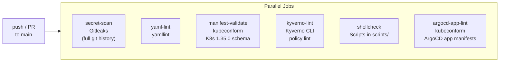

# Universal Cloud Platform — Architecture Overview

**Last updated:** 2026-04-05  
**Cluster:** AOS01 / AOS02 / AOS03 · Kubernetes v1.35.3 · 3-node HA  
**Repo:** `https://github.com/StanleyXie/Universal-Cloud-Platform`

---

## 1. High-Level Architecture



---

## 2. Cluster Infrastructure

| Node | Role | IP | OS |
|------|------|----|----|
| aos01 | control-plane | 192.168.32.11 | Ubuntu (NUC) |
| aos02 | control-plane | 192.168.32.12 | Ubuntu (NUC) |
| aos03 | control-plane + worker | 192.168.32.13 | Ubuntu (NUC) |
| — | kube-vip VIP | 192.168.32.10 | — |

- **CNI:** Cilium v1.19.2 — kube-proxy replacement, eBPF dataplane
- **HA:** kubeadm stacked etcd, kube-vip L2 control-plane VIP
- **Storage:** local-path-provisioner (default StorageClass, `local-path`)

---

## 3. GitOps — ArgoCD App-of-Apps

```mermaid
flowchart TD
    root["root App\n(watches apps/)"]

    root --> w0a["wave 0\nargocd\n(self-managed)"]
    root --> w0b["wave 0\ncilium"]
    root --> w0c["wave 0\nlocal-path-provisioner"]

    root --> w1a["wave 1\nkyverno"]
    root --> w1b["wave 1\ngateway-api"]
    root --> w1c["wave 1\nkyverno-policies\n(baseline)"]
    root --> w1d["wave 1\nkyverno-custom-policies"]

    root --> w2a["wave 2\ncrossplane"]
    root --> w2b["wave 2\ncrossplane-providers"]
    root --> w2c["wave 2\ncrossplane-providerconfigs"]

    root --> w3a["wave 3\nsearxng"]

    style w0a fill:#d4edda,stroke:#28a745
    style w0b fill:#d4edda,stroke:#28a745
    style w0c fill:#d4edda,stroke:#28a745
    style w1a fill:#cce5ff,stroke:#004085
    style w1b fill:#cce5ff,stroke:#004085
    style w1c fill:#cce5ff,stroke:#004085
    style w1d fill:#cce5ff,stroke:#004085
    style w2a fill:#fff3cd,stroke:#856404
    style w2b fill:#fff3cd,stroke:#856404
    style w2c fill:#fff3cd,stroke:#856404
    style w3a fill:#f8d7da,stroke:#721c24
```



All apps use `automated: {prune: true, selfHeal: true}` (except `argocd` which uses `prune: false`).  
Helm values are sourced from the same repo via the multi-source `ref:` pattern.

---

## 4. Networking — Gateway API & L2



**Key components:**

| Resource | Kind | Details |
|----------|------|---------|
| `platform-gateway` | `Gateway` | Namespace `networking`, GatewayClass `cilium`, port 80 HTTP, `allowedRoutes.namespaces: All` |
| `platform-lb-pool` | `CiliumLoadBalancerIPPool` | 192.168.32.100 – 192.168.32.110 |
| `platform-l2-policy` | `CiliumL2AnnouncementPolicy` | Interfaces `^enp.*`, LoadBalancer IPs only |
| `cilium-operator-l2-announcements` | `ClusterRole` + `ClusterRoleBinding` | Supplemental RBAC — Cilium 1.19.2 chart omits `ciliuml2announcementpolicies` from operator ClusterRole |

**Known fix applied:** Cilium 1.19.2 Helm chart does not grant the operator RBAC for `ciliuml2announcementpolicies`. Without it the L2 announcer silently does nothing. Fixed via `gateway-api/cilium-l2-rbac.yaml`.

---

## 5. Policy — Kyverno



**ClusterPolicies (custom):**

| Policy | Mode | Purpose |
|--------|------|---------|
| `disallow-default-namespace` | Enforce | Blocks workloads in `default` namespace |
| `require-resource-limits` | Audit | All containers must declare CPU + memory limits |
| `restrict-external-ips` | Enforce | Services may not specify `.spec.externalIPs` (CVE-2020-8554 mitigation) |
| `require-crossplane-labels` | Audit | Crossplane managed resources must carry `crossplane.io/claim-name` label |

---

## 6. Cloud Management — Crossplane



All providers use `DeploymentRuntimeConfig: default` for resource limits.  
Credentials are stored as Kubernetes Secrets (created by `platform/scripts/setup-credentials.sh` — **not yet configured**).

**provider-cloudflare status:** Disabled. The `wildbitca/provider-upjet-cloudflare` fork has unfixable CRD generation defects. The official `crossplane-contrib/provider-upjet-cloudflare` has no published xpkg release yet. Monitor [releases](https://github.com/crossplane-contrib/provider-upjet-cloudflare/releases).

---

## 7. Services

| Service | Namespace | Helm Chart | Exposed At |
|---------|-----------|------------|------------|
| SearXNG | `common-svc` | unknowniq/searxng 0.1.10 | `http://search.aos.local` → 192.168.32.100:80 |

**SearXNG notes:**
- Secret key managed via `platform/scripts/setup-searxng-secret.sh` (random generation, stored in `searxng-secret`)
- Valkey/Redis disabled; chart injects empty `valkey.url` causing crash — fixed with `extraConfig.valkey.url: "false"` in values
- HTTPRoute configured via chart-native `route:` block targeting `platform-gateway`

---

## 8. CI/CD — GitHub Actions Security Workflow

File: `.github/workflows/security.yml`



---

## 9. Project Repository Structure

```
universal-cloud-platform/           ← project root (local only, not a git repo)
├── .gitignore                      ← excludes DS_Store, join-command.txt, secrets
├── platform/                       ← git repo → github.com/StanleyXie/Universal-Cloud-Platform
│   ├── .github/workflows/
│   │   └── security.yml            ← CI security scanning
│   ├── apps/                       ← ArgoCD Application manifests (app-of-apps)
│   ├── argocd/                     ← ArgoCD Helm values
│   ├── cilium/                     ← Cilium Helm values
│   ├── crossplane/                 ← Crossplane Helm values
│   ├── crossplane-providers/       ← Provider CRs (AWS/GCP/Azure/Terraform)
│   ├── crossplane-providerconfigs/ ← ProviderConfig CRs
│   ├── gateway-api/                ← CRD kustomization + Gateway + L2 pool + RBAC fix
│   ├── kyverno/                    ← Kyverno Helm values
│   ├── kyverno-policies/           ← Upstream baseline policy Helm values
│   ├── kyverno-custom-policies/    ← Custom ClusterPolicies + PolicyExceptions
│   ├── local-path-provisioner/     ← StorageClass manifest
│   ├── scripts/                    ← setup-searxng-secret.sh, setup-credentials.sh
│   └── searxng/                    ← SearXNG Helm values
├── docs/
│   ├── plans/                      ← Architecture & progress docs
│   └── issues/                     ← Resolved issue notes
├── provider-upjet-cloudflare/      ← git repo (fork, paused)
└── scripts/
    ├── bootstrap-argocd.sh         ← Day-0 ArgoCD install + root app apply
    └── k8s/                        ← Cluster setup scripts
        └── join-command.txt        ← ⚠ gitignored — contains bootstrap token
```

---

## 10. Pending / Roadmap

| Item | Priority | Notes |
|------|----------|-------|
| Observability stack | High | kube-prometheus-stack + Loki + Promtail, wave 4 |
| Cloud credentials | Medium | Run `scripts/setup-credentials.sh` to populate provider secrets |
| provider-cloudflare | Low | Monitor crossplane-contrib/provider-upjet-cloudflare for first release |
| TLS on platform-gateway | Low | Add HTTPS listener + cert-manager for `*.aos.local` |
| ArgoCD OIDC / SSO | Low | Replace admin password auth |
