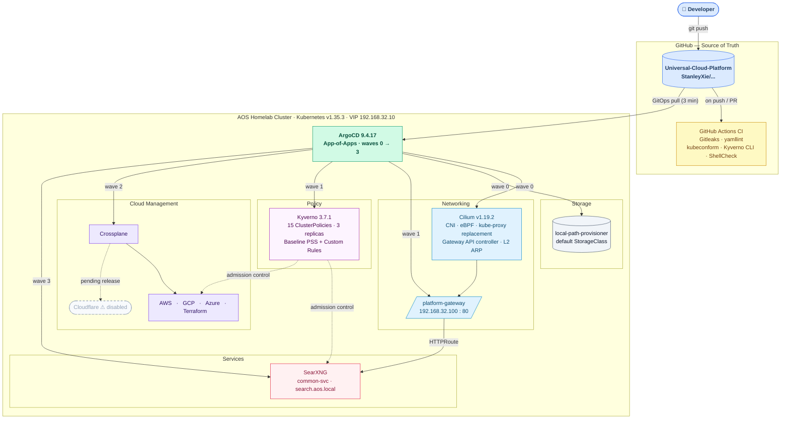
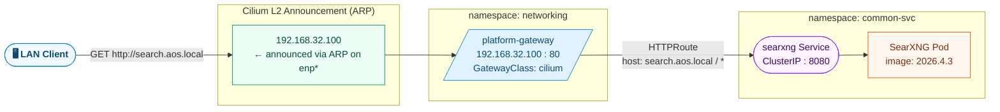
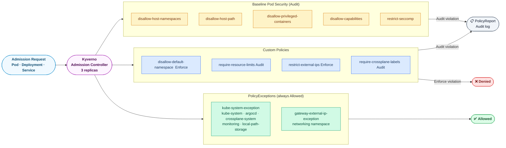
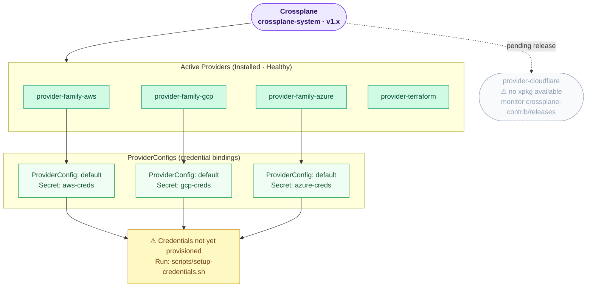
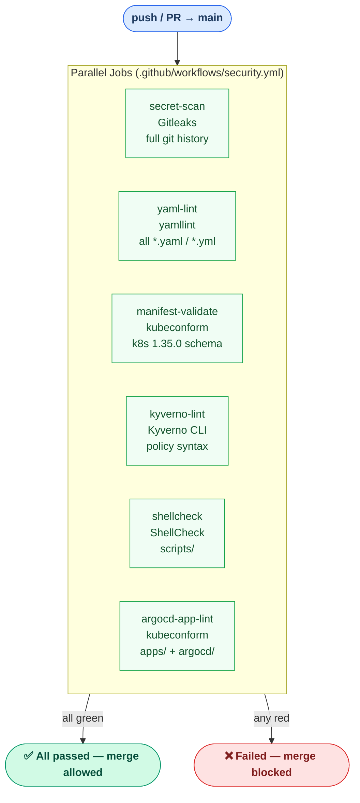

# Universal Cloud Platform — Architecture Overview

**Last updated:** 2026-04-05 (CI all green)  
**Cluster:** AOS01 / AOS02 / AOS03 · Kubernetes v1.35.3 · 3-node HA  
**Repo:** `https://github.com/StanleyXie/Universal-Cloud-Platform`

---

## 1. Platform Overview



---

## 2. Cluster Nodes

| Node | Role | IP |
|------|------|----|
| aos01 | control-plane | 192.168.32.11 |
| aos02 | control-plane | 192.168.32.12 |
| aos03 | control-plane + worker | 192.168.32.13 |
| — | kube-vip VIP | 192.168.32.10 |

- **CNI:** Cilium v1.19.2 · eBPF dataplane · kube-proxy replacement
- **HA:** kubeadm stacked etcd · kube-vip L2 control-plane VIP
- **Storage:** local-path-provisioner · `local-path` default StorageClass

---

## 3. GitOps — Sync Wave Deployment Order

```mermaid
flowchart LR
    classDef root fill:#f8fafc,stroke:#475569,color:#0f172a,font-weight:bold
    classDef w0   fill:#d1fae5,stroke:#059669,color:#064e3b
    classDef w1   fill:#dbeafe,stroke:#2563eb,color:#1e3a5f
    classDef w2   fill:#fef3c7,stroke:#d97706,color:#78350f
    classDef w3   fill:#fce7f3,stroke:#db2777,color:#831843

    ROOT(["root App\ngithub: apps/"]):::root

    subgraph W0["Wave 0 — Infrastructure Bootstrap"]
        direction TB
        A0["ArgoCD 9.4.17\nself-managed"]:::w0
        B0["Cilium v1.19.2\nCNI · L2 · Gateway API"]:::w0
        C0["local-path-provisioner\ndefault StorageClass"]:::w0
    end

    subgraph W1["Wave 1 — Policy & Networking"]
        direction TB
        A1["Kyverno 3.7.1\nController"]:::w1
        B1["gateway-api\nCRDs + platform-gateway"]:::w1
        C1["kyverno-policies\nBaseline PSS"]:::w1
        D1["kyverno-custom-policies\nCustom rules + exceptions"]:::w1
    end

    subgraph W2["Wave 2 — Cloud Management"]
        direction TB
        A2["Crossplane"]:::w2
        B2["crossplane-providers\nAWS · GCP · Azure · Terraform"]:::w2
        C2["crossplane-providerconfigs\nCredential bindings"]:::w2
    end

    subgraph W3["Wave 3 — Services"]
        A3["SearXNG\nsearch.aos.local"]:::w3
    end

    ROOT --> W0 --> W1 --> W2 --> W3
```



All apps: `automated: {prune: true, selfHeal: true}` — except `argocd` which uses `prune: false`.  
Helm values sourced from the same repo via multi-source `ref:` pattern.

---

## 4. Networking — Traffic Flow



**L2 components:**

| Resource | Kind | Value |
|----------|------|-------|
| `platform-lb-pool` | `CiliumLoadBalancerIPPool` | 192.168.32.100 – .110 |
| `platform-l2-policy` | `CiliumL2AnnouncementPolicy` | interfaces `^enp.*` · LoadBalancer IPs |
| `cilium-operator-l2-announcements` | `ClusterRole` + `ClusterRoleBinding` | Supplemental RBAC — Cilium 1.19.2 chart omits `ciliuml2announcementpolicies` from operator ClusterRole |

---

## 5. Policy — Kyverno Admission Flow



---

## 6. Cloud Management — Crossplane Providers



---

## 7. CI/CD — Security Workflow



**Status: all 6 jobs passing.** Known issues resolved during initial setup:

| Symptom | Root Cause | Fix |
|---------|-----------|-----|
| kubeconform exit 123 | `/releases/latest` redirect not followed | Pinned to explicit `v0.7.0` URL |
| kubeconform `missing 'kind' key` | Helm `values.yaml` picked up by `find` | Excluded `values.yaml` from find |
| ClusterRole schema rejection | Invalid `spec: {}` on `cilium-l2-rbac.yaml` | Removed `spec: {}` |
| Kyverno CLI tar error | Binary extracted as `kyverno`, conflicted with `kyverno/` checkout dir | Extract to `/tmp/kyverno-cli/` |
| `kyverno lint` unknown command | `lint` subcommand removed in v1.17 | Use `kyverno apply --resource test/sample-pod.yaml` |
| yamllint `document-start` warnings | Missing `---` on K8s manifests (not required) | Disabled `document-start` rule |

---

## 8. Services

| Service | Namespace | Chart | Endpoint |
|---------|-----------|-------|----------|
| SearXNG | `common-svc` | unknowniq/searxng 0.1.10 | `http://search.aos.local` → 192.168.32.100:80 |

**Notes:**
- Secret key: `scripts/setup-searxng-secret.sh` → K8s Secret `searxng-secret`
- Valkey/Redis disabled; chart injects empty `valkey.url` causing crash → fixed with `extraConfig.valkey.url: "false"`
- HTTPRoute configured via chart-native `route:` block targeting `platform-gateway`

---

## 9. Repository Structure

```
Universal-Cloud-Platform/  (github.com/StanleyXie/Universal-Cloud-Platform)
│
├── .github/workflows/
│   └── security.yml               ← CI: Gitleaks · yamllint · kubeconform · Kyverno CLI · ShellCheck
│
├── apps/                          ← ArgoCD App-of-Apps (root watches this dir)
│   ├── argocd.yaml                  wave 0
│   ├── cilium.yaml                  wave 0
│   ├── local-path-provisioner.yaml  wave 0
│   ├── kyverno.yaml                 wave 1
│   ├── gateway-api.yaml             wave 1
│   ├── kyverno-policies.yaml        wave 1
│   ├── kyverno-custom-policies.yaml wave 1
│   ├── crossplane.yaml              wave 2
│   ├── crossplane-providers.yaml    wave 2
│   ├── crossplane-providerconfigs.yaml wave 2
│   ├── searxng.yaml                 wave 3
│   └── root.yaml                  ← self-referencing root app
│
├── argocd/                        ← ArgoCD Helm values
├── cilium/                        ← Cilium Helm values (CNI + Gateway API + L2)
├── crossplane/                    ← Crossplane Helm values
├── crossplane-providers/          ← Provider CRs (AWS/GCP/Azure/Terraform)
│   └── provider-terraform.yaml    ← uses DeploymentRuntimeConfig (ControllerConfig deprecated v1.16+)
├── crossplane-providerconfigs/    ← ProviderConfig CRs (credential bindings)
├── gateway-api/                   ← CRD kustomization + Gateway + L2 pool + RBAC fix
├── kyverno/                       ← Kyverno Helm values
├── kyverno-policies/              ← Upstream Baseline PSS Helm values
├── kyverno-custom-policies/       ← Custom ClusterPolicies + PolicyExceptions
├── local-path-provisioner/        ← StorageClass manifest
├── searxng/                       ← SearXNG Helm values
│
├── scripts/                       ← Cluster-level setup scripts
│   ├── setup-credentials.sh         cloud provider secrets
│   └── setup-searxng-secret.sh      SearXNG secret key generation
│
├── bootstrap/                     ← Day-0 scripts (run once)
│   ├── bootstrap-argocd.sh          Helm install ArgoCD + apply root app
│   └── k8s/                         Node setup scripts (kubeadm init/join)
│
├── test/
│   └── sample-pod.yaml            ← Minimal Pod for Kyverno CI policy checks
│
└── docs/
    ├── plans/                     ← Architecture & design docs
    └── issues/                    ← Resolved issue write-ups
```

---

## 10. Access

| Service | Address | Notes |
|---------|---------|-------|
| ArgoCD UI | `https://192.168.32.11:30843` | admin user |
| SearXNG | `http://search.aos.local` | add `192.168.32.100 search.aos.local` to `/etc/hosts` |
| Platform Gateway | `192.168.32.100:80` | Cilium L2 ARP, HTTPRoute routing |
| kubectl | `~/.kube/config` | merged from remote cluster |

SSH: `ssh stanley@192.168.32.11`

---

## 11. Pending / Roadmap

| Item | Priority | Notes |
|------|----------|-------|
| Observability | High | kube-prometheus-stack + Loki + Promtail · wave 4 |
| Cloud credentials | Medium | Run `scripts/setup-credentials.sh` |
| provider-cloudflare | Low | Monitor [crossplane-contrib/provider-upjet-cloudflare](https://github.com/crossplane-contrib/provider-upjet-cloudflare/releases) |
| TLS on gateway | Low | Add HTTPS listener + cert-manager for `*.aos.local` |
| ArgoCD SSO | Low | Replace admin password with OIDC |
